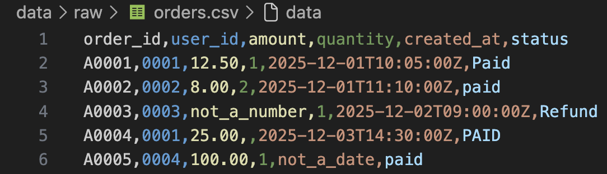
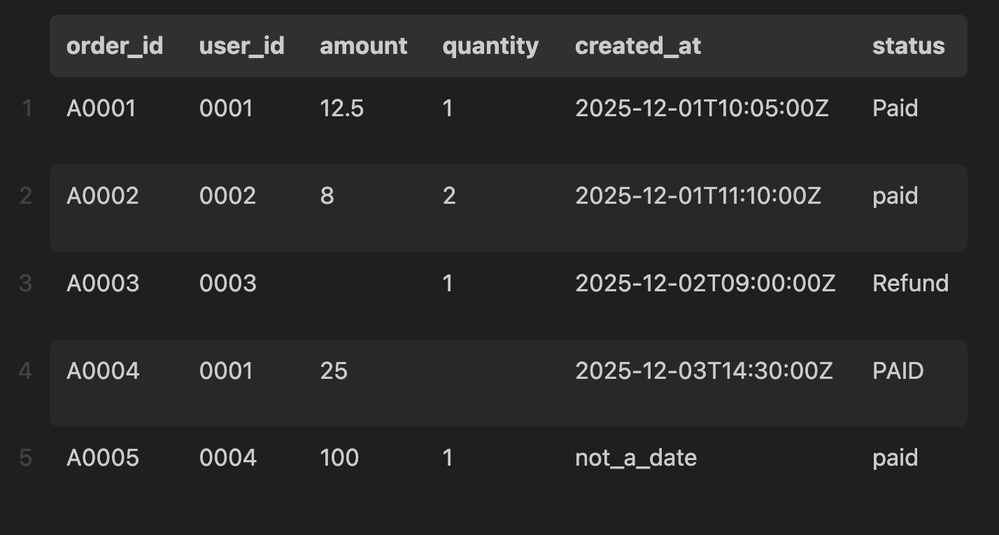

# ETL Pipeline
Implements a structured **ETL (Extract, Transform, Load) pipeline** using Python and Pandas.

## Features
- Extracts raw data from CSV files
- Transforms and cleans data by enforcing schema
- Loads processed data into Parquet format
- Handles missing values using centralized NA markers
- Generates run metadata (_run_meta.json) for reproducibility

## Project Structure
```
.
├── data
│   ├── cache
│   ├── external
│   ├── processed
│   └── raw
│       ├── orders.csv
│       └── users.csv
├── images
│   ├── processed.png
│   └── raw.png
├── pyproject.toml
├── README.md
├── requirements.txt
├── scripts
│   └── run_day1_load.py
├── src
│   └── bootcamp_data
│       ├── __init__.py
│       ├── config.py
│       ├── io.py
│       └── transforms.py
└── uv.lock
```

## Setup
-  Create a virtual environment (at the project root):

    ```
    uv init
    ```
    ```
    uv sync
    ```

- Activate it:

    (Linux/Mac) 
    ```
    source .venv/bin/activate
    ``` 
    
    (Windows)
    ```
    .venv\Scripts\Activate.ps1
    ``` 

- Install dependencies:

    ```
    uv add pandas pyarrow httpx
    ```

## How to Run the Pipeline
From the project root, run:

```
python scripts/run_day1_load.py
```

## Example Input/Output
**Input: orders.csv**



**Output: orders.parquet**

