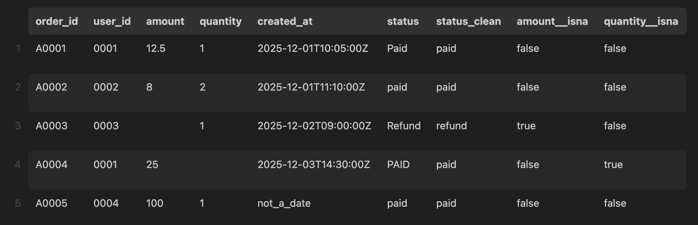

# ETL Pipeline with Data Quality, Joins & Analytics
Structured ETL pipeline with data quality validation, datetimes, outliers, joinsusing Python and Pandas.

## Features
- Extracts and validates CSV data
- Enforces schema and type validation
- Creates missingness reports and adds missing value flags
- Normalizes text data
- Adds missing value flags
- Parses datetime columns and extracts time components
- Performs safe left joins with validation
- Detects outliers
- Exports to Parquet with logging

## Project Structure
```
.
├── data
│   ├── processed
│   │   ├── _run_meta.json
│   │   ├── analytics_table.parquet
│   │   ├── orders_clean.parquet
│   │   ├── orders.parquet
│   │   └── users.parquet
│   └── raw
│       ├── orders.csv
│       └── users.csv
├── images
│   ├── processed_day1.png
│   ├── processed_day2.png
│   └── raw.png
├── pyproject.toml
├── README.md
├── reports
│   ├── figures
│   └── missingness_orders.csv
├── scripts
│   ├── run_day1_load.py
│   ├── run_day2_clean.py
│   └── run_day3_build_analytics.py
├── src
│   └── data_workflow
│       ├── __init__.py
│       ├── config.py
│       ├── io.py
│       ├── joins.py
│       ├── quality.py
│       └── transforms.py
└── uv.lock
```

## Setup
-  Create a virtual environment (at the project root):

    ```
    uv init
    ```
    ```
    uv sync
    ```

- Activate it:

    (Linux/Mac) 
    ```
    source .venv/bin/activate
    ``` 
    
    (Windows)
    ```
    .venv\Scripts\Activate.ps1
    ``` 

- Install dependencies:

    ```
    uv add pandas pyarrow httpx
    ```

##  How to Run
**Important: Scripts must be run in sequential order**
### Day 1: Basic ETL Pipeline
From the project root, run:

```
python scripts/run_day1_load.py
```
### Day 2: Data Quality and Cleaning
From the project root, run:

```
python scripts/run_day2_clean.py
```
### Day 3: Analytics Table Construction
From the project root, run:

## Example Input/Output
**Input: orders.csv**


**output: orders.parquet**


**output: orders_clean.parquet**


```
python scripts/run_day3_build_analytics.py
```
